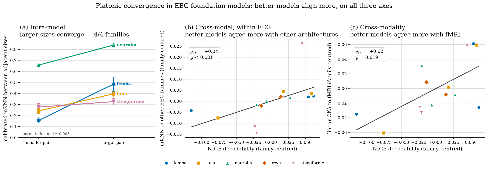
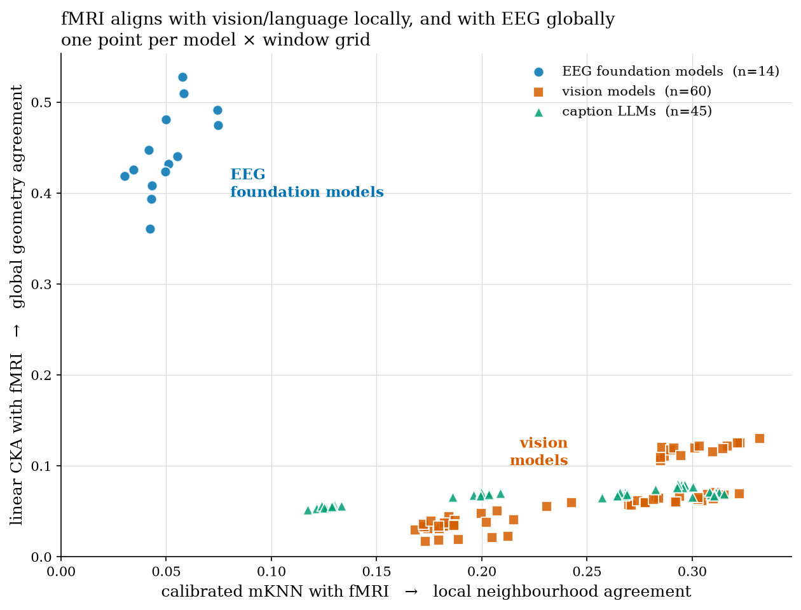

# Results

**Does the Platonic Representation Hypothesis hold for brain foundation models?**

Huh et al. (2024) showed that as vision and language models get bigger and better, their
representations converge. We ask whether the same happens for models trained on **brain activity**,
on [CineBrain](https://huggingface.co/datasets/Fudan-fMRI/CineBrain) Season 7 (naturalistic movie
watching, 6 subjects), along three axes:

| Axis | Question |
|---|---|
| **1. Intra-model** | Within one EEG architecture, do larger sizes converge on the same representation? |
| **2. Cross-model, intra-modality** | Do *different* EEG architectures converge on each other? |
| **3. Cross-modality** | Do EEG models converge with fMRI, vision, language? |

Metrics: **mKNN** (permutation-calibrated mutual k-NN overlap — *local* neighbourhood structure)
and **linear CKA** (*global* similarity-matrix agreement). Controls: block permutation (preserves
temporal autocorrelation) and a shift null (re-pairs at temporal offsets *d*).

**The performance axis.** PRH needs a notion of "better model", but EEG foundation models have no
accepted benchmark. We define one from the neuroscience side: how well a model's embeddings
linearly decode **NICE-style neural markers** from the raw EEG (band power δ/θ/α/β, spectral
entropy, median frequency, spectral edge, permutation entropy, Hjorth — 16 scalars, ridge +
block CV). It works: **14/16 features have positive median R²** across the 14 EEG variants
(Hjorth mobility median **0.84**, max **0.98**).

> **Methodological point that drives everything below.** The 5 EEG architectures sit at very
> different baseline alignment levels, so pooling all 14 variants **hides the trend**
> (NICE-R² vs cross-arch mKNN: ρ = +0.27, p = 0.34). The comparison must be made *within*
> architecture — ANCOVA with family dummies, or equivalently mean-centring within family.
> Every headline number below is family-corrected.



---

## Axis 1 — Larger EEG models converge (4/4 families)

For every family, alignment between the **two largest** sizes exceeds that between the **two
smallest** — no exceptions:

| Family | small pair | large pair | Δ |
|---|---|---|---|
| FEMBA | tiny→base **0.156** | base→large **0.485** | **+0.329** |
| LUNA | base→large **0.242** | large→huge **0.397** | **+0.155** |
| NeuroLM | b→l **0.657** | l→xl **0.839** | **+0.182** |
| ST-EEGFormer | small→base **0.277** | base→large **0.326** | **+0.049** |

Calibrated mKNN, mean over 6 subjects, against a permutation null of ≈0.003. **Sign-test
p = 0.063.** NeuroLM l↔xl at 0.839 is near-total representational agreement.

## Axis 2 — Different EEG architectures converge, and better models converge more

Each variant's mean alignment to models of *other families* rises from smallest to largest size in
**5/5 families on CKA** (sign-test p = 0.031) and **4/5 on mKNN** (p = 0.063; NeuroLM is the
exception). Family-corrected:

| Predictor | vs cross-family mKNN | vs cross-family CKA |
|---|---|---|
| Size rank | ρ_adj = **+0.60**, p = 0.023 | ρ_adj = **+0.76**, p = 0.002 |
| **NICE decodability** | ρ_adj = **+0.84**, p < 0.001 | ρ_adj = **+0.82**, p < 0.001 |

Same-family pairs are **excluded** here: a model's alignment to its own siblings is ~5× higher than
to other families (0.50 vs 0.10 mKNN), so leaving them in would let Axis 1 leak into Axis 2. The
conclusion is unchanged either way (NICE vs mKNN ρ_adj = +0.84 excluding siblings, +0.82 including).

**The better an EEG model decodes neural markers, the more its representation agrees with other
EEG architectures** — the PRH statement restated for brain models, with decodability predicting
convergence better than raw scale.

## Axis 3 — Better EEG models align more with fMRI

| Predictor | vs fMRI mKNN | vs fMRI CKA |
|---|---|---|
| Size rank | ρ_adj = **+0.60**, p = 0.023 | ρ_adj = **+0.77**, p = 0.001 |
| **NICE decodability** | ρ_adj = **+0.88**, p < 0.001 | ρ_adj = **+0.62**, p = 0.019 |

The repo's ANCOVA (`fmri_eeg_decodability.py`, family dummies + type-II SS) gives the conservative
version: **CKA β_adj = +0.49, p = 0.022; mKNN β_adj = +0.07, p = 0.044**. fMRI CKA rises with EEG
size in 4/5 families, and even the *uncorrected* pooled Spearman is significant (ρ = +0.55,
p = 0.040).

A better EEG model is more aligned with an entirely different brain-imaging modality — convergence
toward something about the brain's response to the stimulus, not an artifact of one recording
technology.

---

## Axis 3b — fMRI is the pivot: local agreement with vision/language, global agreement with EEG

Treating raw preprocessed fMRI as just another embedding of the same stimulus windows separates the
modalities almost perfectly:



| fMRI vs | mKNN (local) | CKA (global) |
|---|---|---|
| Vision | **0.25** (max 0.33, DINOv2) | 0.07 |
| LLMs | **0.24** (max 0.31) | 0.07 |
| EEG FMs | 0.05 | **0.45** (range 0.36–0.53) |

**fMRI aligns with vision and language models better than EEG does** — and it should: fMRI has the
spatial resolution to represent stimulus content, so its neighbourhood structure tracks *which
windows look and mean alike*. That is the Platonic claim, now with a brain modality on one side.

**But fMRI also aligns with EEG — through the other metric.** CKA 0.36–0.53 is the largest global
agreement anywhere in the study, while the two modalities' nearest-neighbour sets barely overlap.

### How can two spaces be globally aligned but not locally?

The most interesting open question here — and a hypothesis, not a result. Linear CKA compares Gram
matrices and is **dominated by the highest-variance directions**. If fMRI and EEG share a few strong, slow components — global arousal/state drift, the
coarse temporal envelope of the movie — the two similarity matrices correlate strongly. But such a
component is **low-dimensional**: it sorts windows into broad regions, and within any level-set of
it there are hundreds of candidates. Which window is the 5th nearest neighbour is then decided by
the *remaining* dimensions, where EEG is dominated by non-stimulus noise. mKNN at k=5 of 1350
windows probes the top ~0.4% of proximities — the finest scale available. So a shared coarse axis
is exactly the thing CKA sees and mKNN cannot.

Vision/fMRI is the mirror image: agreement about which windows depict similar content (neighbour
sets overlap) without agreement about the overall geometry (low linear CKA).

**Two cheap falsifiable tests, neither run yet:**
1. **PC ablation** — remove the top-*k* principal components from fMRI and EEG and recompute CKA.
   If a few dominant components carry it, CKA should collapse by *k* ≈ 1–5.
2. **k-sweep** — recompute mKNN at k = 5, 20, 50, 100, 200. If EEG↔fMRI agreement is genuinely
   coarse, its mKNN should climb with k far more steeply than vision↔fMRI's.

**Consistent with this, EEG × vision and EEG × language mKNN is a null:** only 0.02–0.04, and it
does not clear the conservative nulls (EEG × LLM shift p = 0.25–0.50, block p = 0.056–0.071). We
report it as a negative — and the dissociation above says it is a **metric–geometry mismatch**
rather than an absence of shared structure.

*(Pipeline check: we reproduce the known vision×LLM result — mKNN to 0.379, monotonic in 12/12
vision variants. Huh et al.'s finding, not ours.)*

---

## Conclusions (draft — for you to correct)

1. **PRH holds for brain foundation models on the within-modality axes.** Larger EEG models
   converge on each other (4/4 families) and on other architectures (5/5 on CKA, 4/5 on mKNN).
2. **"Better" beats "bigger" as the predictor** — NICE decodability outpredicts size rank for
   cross-family alignment (+0.84 vs +0.60) and fMRI alignment (+0.88 vs +0.60). The PRH axis for
   brain models is representational quality, not parameter count.
3. **The convergence target is cross-modal within the brain**: better EEG models align more with
   fMRI, a modality with different physics and different noise.
4. **fMRI aligns with vision/language models better than EEG does**, and with EEG better than
   either — but through a different metric each time. fMRI is the bridge between stimulus models
   and electrophysiology.
5. **Global-but-not-local alignment is a geometry finding worth chasing** — plausibly a shared
   low-dimensional component that CKA rewards and mKNN cannot see. Two tests proposed above.
6. **The architecture confound is a real methodological result.** Pooling EEG variants across
   families destroys every trend (p = 0.34 → p < 0.001 once corrected). Future work on this data
   must analyse within-family.
7. **A usable performance axis for EEG FMs exists.** NICE-marker decodability is measurable,
   discriminates models, and behaves like a PRH performance axis.

## Caveats to state, not bury

- **Family-centred Spearman p-values are anti-conservative** — centring on 5 families costs df that
  `spearmanr` does not account for at n = 14. The ANCOVA numbers (β_adj = +0.49, p = 0.022) are the
  defensible ones; treat ρ_adj as descriptive and directionally consistent.
- **n = 14 EEG variants across 5 families** binds axes 2 and 3; axis 1 rests on 4 families × 2
  size-pairs. Directions are consistent, power is thin.
- **The fMRI mKNN margin over the shift null is small** — 0.212 at d=0 vs 0.201 at d=8 s (neurolm
  grid). d=0 is the maximum on all 5 grids, but by only ~1–5% relative, so part of the fMRI
  neighbourhood structure is shared temporal smoothness. The Axis-3b *dissociation* is robust; the
  absolute mKNN magnitude must be shown with this control.
- **Axis 1 compares sibling sizes of one architecture**, which share training data and objective —
  a weaker claim than cross-architecture convergence (Axis 2).
- fMRI and EEG differ in preprocessing, temporal resolution (TR = 0.8 s) and dimensionality, so
  EEG-vs-fMRI *magnitude* comparisons are suggestive, not controlled.

---

## Figures

Curated set in [`figures/`](figures/) (tracked). F1 and F7 are new scripts; the rest are copied
from `src/alignment_plots/outputs/` (tracked) and `src/interp/outputs/` (**gitignored** —
regenerate with the interp runners).

| File | Axis | Shows |
|---|---|---|
| `f1_prh_three_axes.png` | all | **The spine.** One panel per axis, family-centred; three upward slopes. |
| `f2_intramodal_scaling.png` | 1 | Within-family mKNN per size pair vs the permutation null. |
| `f3a/f3b_crossarch_{mknn,cka}.png` | 2 | 14×14 cross-architecture alignment matrices. |
| `f4_fmri_vs_decodability.png` | 3 | Added-variable plot, family confound residualised out. |
| `f5_nice_decodability.png` | — | The performance axis itself: NICE R² per variant. |
| `f6_fmri_scaling.png` | 3 | fMRI alignment vs scale, one line per family. |
| `f7_fmri_dissociation.png` | 3b | **The dissociation.** mKNN vs CKA, coloured by modality. |
| `f8_eeg_vision_nulls.png` | 3b | The negative, stated plainly: shift + block-permutation nulls. |
| `f9_perfeature_rho.png` | 2 | Which NICE features drive cross-arch alignment (pe_theta ρ=+0.91, p=7.3e-6, survives Bonferroni). |

```bash
venv/bin/python src/alignment_plots/prh_axes.py          # F1
venv/bin/python src/alignment_plots/fmri_dissociation.py # F7

# regenerate the inputs (embeddings stream from HuggingFace)
SKIP_BPB=1 SKIP_EXTRACT=1 SKIP_VIDEO=1 bash src/alignment_plots/run_all.sh  # alignment figures
bash src/interp/run-components.sh && bash src/interp/run-extra-studies.sh   # NICE + cross-arch
```

**Still to run:** stage-4 cross-modal figures exist for **NeuroLM only** — the other 4 EEG families
have no `video_vs_eeg__*` / `language_vs_eeg__*`. The `run_all.sh` line above fills them (CPU-only,
run locally; add `PLOT_KPERM=50` to speed up the permutation stats).

Repos: `nitrox639/platonic-embeddings` (EEG + EEG-grid vision), `triniborrell/platonic-embeddings`
(LLMs + the 4 s `clip4s` grid). Runbook: `src/RUN_SCALEWAY_RENDER_AND_INTERP.md` · nulls:
`src/alignment_plots/SIGNIFICANCE.md` · methods: `README.md`, `src/alignment_plots/README.md`,
`src/interp/README.md`.
